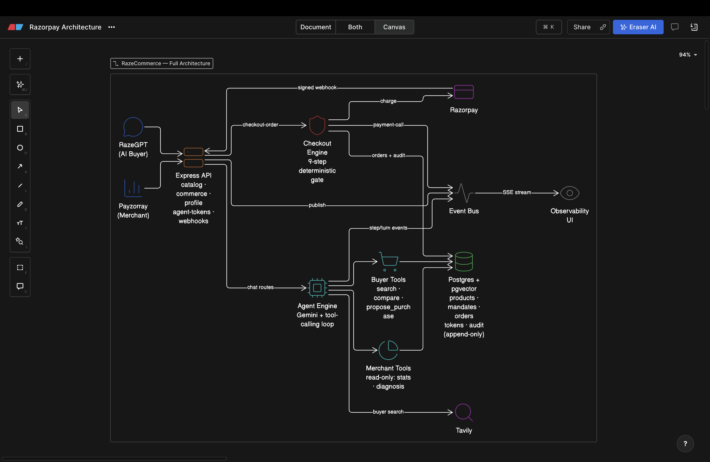
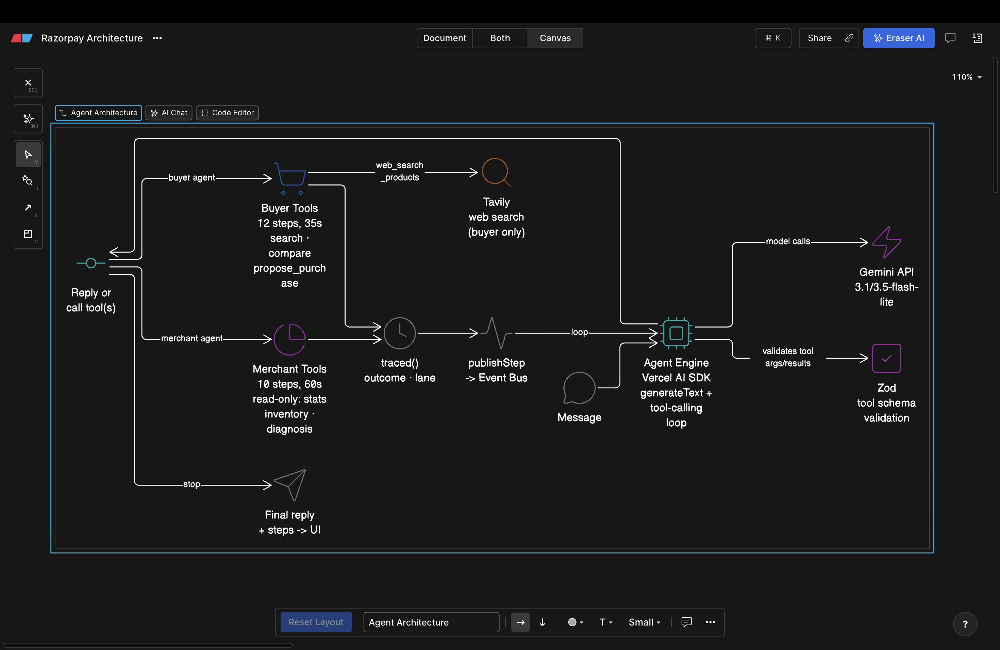

# Payzorray

*Two LLM agents that actually move real money and real inventory, kept honest by a deterministic gate neither of them can talk its way past.*


# VIDEO DEMO 

*I MAY HAVE GIVEN THE WRONG URL IN THE GOOGLE FORM, PLEASE WATCH THE YOUTUBE DEMP FROM HERE*
<p align="center">
  <a href="https://youtube.com">
    
  </a>
</p>

<p align="center">
  
  &nbsp;&nbsp;
  
</p>

<p align="center">
  
  
  
  
  
  
  
  
</p>

An agentic commerce platform built for a hackathon: two LLM agents — a buyer agent (**RazeGPT**) and a merchant agent (**Payzorray**) — that can actually search a real catalog, place real Razorpay orders, and run a real merchant's storefront, sitting on top of one Express + Postgres (Supabase, with pgvector) backend. It was built with Claude Code, which is on-theme for the event rather than something to hide — what's worth showing is how it's built, not that it was built fast.

---

## The idea the whole codebase is organized around

Every interesting design decision here traces back to one rule: **the AI proposes, deterministic code decides and executes.** An LLM tool call can suggest a product, suggest a discount, suggest cancelling an order — but it never touches money or a database row directly. A `propose_purchase` tool call returns a candidate; a separate, boring, fully-tested checkout sequence re-validates price, stock, delivery, policy, and mandate cap from scratch before a payment call happens. If the AI is wrong, or hallucinates, or gets talked into something adversarial, the worst case is a rejected proposal, not a bad charge.

Here's the whole system end to end — two chat surfaces talking to one Express API, one Postgres database doing double duty as the product catalog (pgvector) and the ledger (mandates, orders, audit), and an event bus feeding a live observability UI over SSE:

<p align="center">
  
</p>

## What's actually in here

Three separate Vite/React apps share the one backend, each doing a genuinely different job rather than being reskins of each other:

| App | Surface | What it actually does |
|---|---|---|
| `frontend-ai-buyer` | RazeGPT — buyer chat | Real cart, real Razorpay Checkout.js, a persisted spending-cap wallet, coupon application at both single-item and whole-cart granularity, order tracking, invoices |
| `frontend-merchant` | Payzorray — merchant dashboard | Sales analytics computed from actual order rows (not a mock), a catalog "AI findability" grader, coupon/bundle campaign creation, a chat agent scoped to that one merchant's own data |
| `frontend-observability` | Live trace viewer | Streams every tool call, every LLM round-trip, every Razorpay API call, and every audit record as they happen, plus a control that replays any past conversation's exact recorded event sequence at its original pacing |

## The agents

Both agents run on the same mechanism — the Vercel AI SDK's `generateText` with a `tools` object and `stepCountIs()` as the loop's stop condition — but they're two separate files with two separate tool surfaces and two separate step budgets, on purpose, so tuning one can't silently change the other's behavior:

<p align="center">
  
</p>

Merchant questions tend to be one or two heavy analytics calls rather than a long back-and-forth, so the two loops aren't tuned the same:

| | RazeGPT (buyer) | Payzorray (merchant) |
|---|---|---|
| Model | `gemini-3.1-flash-lite` | `gemini-3.1-flash-lite` |
| Step budget | 12 tool-calling rounds | 10 tool-calling rounds |
| Wall-clock cap | 35s per turn | 60s per turn |
| Tool surface | 19 tools, read + write | 10 tools, **read-only** |
| Can move money? | Proposes only — never executes | No |

Every single tool call — args, result, timing, outcome — is captured by a `traced()` wrapper before the model ever sees the result, which is also what feeds the observability stream and the replay feature. The merchant agent's tools are deliberately read-only: a merchant can ask anything about their store (`get_sales_analytics`, `get_low_readiness_products`, `diagnose_business`, `get_upsell_performance`), but nothing in that tool list can change a price, edit a listing, or move money — campaign creation happens through the dashboard's own forms, never through the chat loop. The buyer agent can propose and add to cart, but `propose_purchase` only ever returns a candidate for the checkout gate below to re-validate; it doesn't charge anything itself.

<details>
<summary>All 19 buyer tools</summary>

`search_products` · `web_search_products` · `process_shopping_list` · `find_similar` · `compare_products` · `propose_purchase` · `add_to_cart` · `get_wallet_status` · `get_order_history` · `get_order_details` · `get_order_activity` · `propose_cancellation` · `get_available_coupons` · `check_coupon` · `browse_catalog` · `get_product_details` · `get_invoice` · `get_spending_stats` · `get_profile`

</details>

<details>
<summary>All 10 merchant tools</summary>

`get_merchant_stats` · `get_recent_orders` · `get_order_details` · `get_flagged_events` · `get_low_readiness_products` · `get_inventory_status` · `get_upsell_performance` · `get_campaign_performance` · `get_sales_analytics` · `diagnose_business`

</details>

## The checkout gate

The part of this codebase that got the most attention wasn't the AI — it was making sure the AI's output never becomes an unbounded spend. Three concrete mechanisms do that work.

A **mandate** is a bounded, single-purpose spending authorization (max amount, expiry, one caller type) rather than a standing "yes." Debiting one against concurrent orders had an obvious race — read `remaining_balance`, subtract in JS, write it back — so that's a single atomic Postgres function instead:

```sql
CREATE OR REPLACE FUNCTION debit_mandate(p_approval_id TEXT, p_amount NUMERIC)
RETURNS SETOF mandates LANGUAGE plpgsql AS $$
BEGIN
  RETURN QUERY
  UPDATE mandates
  SET remaining_balance = remaining_balance - p_amount,
      status = CASE WHEN remaining_balance - p_amount <= 0 THEN 'CONSUMED' ELSE status END
  WHERE approval_id = p_approval_id AND status = 'ACTIVE' AND remaining_balance >= p_amount
  RETURNING *;
END; $$;
```

Every order-creation call also carries an idempotency key derived from `(customer_id, conversation_id, approval_id, product_id)` — not a random UUID, but something a retried tool call reproduces exactly — so a flaky network retry or the model deciding to "try that again" replays the cached result instead of charging twice. And the price the agent last mentioned in conversation is never trusted as the transaction amount: `executeCheckoutSequence` re-fetches the product and compares against the caller-supplied price, returning `PRICE_CHANGED` and refusing to proceed if they disagree, whether that mismatch came from a stale quote, a real price change mid-conversation, or the model simply misremembering a number.

## Search and retrieval

Product search is real vector similarity search, not keyword matching with an AI label on it. Every product's `name + description + tags` is embedded once at seed time with `gemini-embedding-001` (768 dimensions), and every query is embedded live and compared via a Postgres `match_products()` function using pgvector's cosine distance operator (`<=>`) against an HNSW index. Two thresholds gate what the agent is even allowed to see: candidates below 0.62 similarity are dropped as noise, and only candidates at or above 0.75 are treated as high-confidence matches worth stating plainly rather than hedging. The catalog behind this is real, seeded product data — 1,324 products across three merchants (500 Hot Wheels die-cast, 377 BigBasket groceries, 447 Flipkart tech/fashion) — not synthetic placeholders.

## What's real, what's simulated, and why

This is the part most write-ups skip, but it's the most interesting engineering finding in the project: on this Razorpay test account, three independent recurring-charge mechanisms were tried and confirmed blocked, not assumed unsupported.

- **UPI Autopay / eMandate registration** — the consent-registration step never completed on this account.
- **Server-to-server token recurring charges** — Razorpay's own order-creation API doesn't error when a recurring `token` block can't be honored; it silently strips the token from the response instead. `createAuthorizationOrder()` checks for that explicitly (`if (!order.token) throw ...`) because trusting the happy path here would have hidden the failure.
- **Subscriptions-based auto-recharge** — same account-level restriction, confirmed through the Subscriptions API directly.

Rather than block the wallet feature entirely, mandates can be marked `simulated` (a real column, added in a dedicated migration) — a fake bank/NPCI consent screen stands in for the registration step, and a charge against a simulated mandate calls `simulateMandateCharge()` instead of a real recurring debit. Every layer that touches this — the DB row, the audit trail, the observability dashboard's payment-method tag — labels it as simulated explicitly; nothing pretends a fake debit is a real gateway confirmation. The one-time Checkout.js flow (a real popup, a real payment, the buyer's own choice of card/UPI/netbanking) is unaffected and used for every actual charge in the demo — the wallet's spend-cap logic (mandate check, idempotency key, price re-validation) is identical either way, deliberately independent of which Razorpay mechanism executes underneath it.

## Project layout

```
src/
  routes/            Express routes -- 66 real endpoints across commerce, AI, merchant, webhooks
  services/
    core/            Checkout sequence, mandate math, idempotency -- no I/O, fully unit-tested
    payments/        Razorpay integration (orders, recurring charges, webhooks, refunds)
    commerce/        Coupons, campaigns, analytics, catalog readiness grading, shipping
    ai/              Both agent loops, both tool surfaces, embeddings, narration
    observability/   The event bus every tool/LLM/payment call publishes onto
  db/                Supabase client, one file per table, marketplace seeding scripts
  db/migrations/     13 numbered, additive SQL migrations -- the real schema history

frontend-ai-buyer/          RazeGPT -- the buyer chat app
frontend-merchant/          Payzorray -- the merchant dashboard
frontend-observability/     Live agent + payment trace viewer
docs/                       Architecture deep-dives, project overview, engineering postmortem
```

## Running it

Backend needs Supabase (Postgres + pgvector), a Razorpay test account, and a Gemini API key — see `.env.example` for the full list, and run every file in `src/db/migrations/` once against your Supabase project, in order.

```bash
npm install && npm test        # 66 tests, no network required
node src/index.js              # backend on :3000

cd frontend-ai-buyer && npm install && npm run dev
cd frontend-merchant && npm install && npm run dev
cd frontend-observability && npm install && npm run dev
```

Catalog seeding is separate and optional — the scripts in `src/db/seed*.js` read from CSVs in `data/marketplace_seed/` (not included in this repo; point them at your own Amazon/BigBasket/Flipkart-style product exports) and call the real Gemini embeddings API, so they're rate-limited deliberately (batched, with cooldowns) rather than fired all at once.

---

## Further reading

[docs/agents-architecture.md](docs/agents-architecture.md) is a full walkthrough of both agents' tool surfaces and guardrails. [docs/project-overview.md](docs/project-overview.md) covers the backend and cross-cutting architecture. [docs/technical-challenges.md](docs/technical-challenges.md) is a short postmortem of the real engineering problems hit while building this — idempotency under agent retries, reconciling two async sources of truth for one payment, why guardrails belong in code rather than the system prompt, and why an agent's own tool-calling loop needs a hard step budget.
